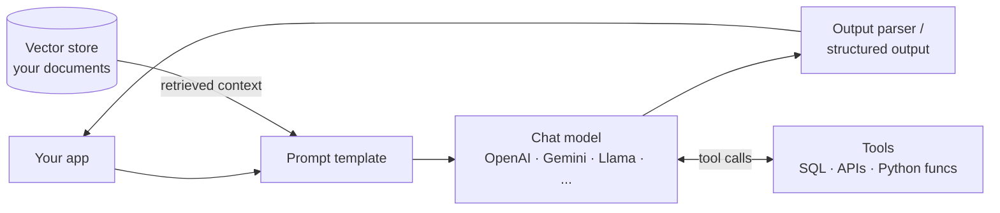
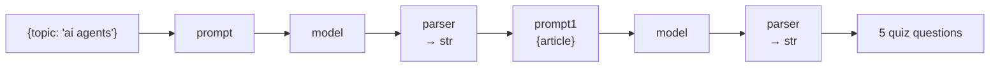
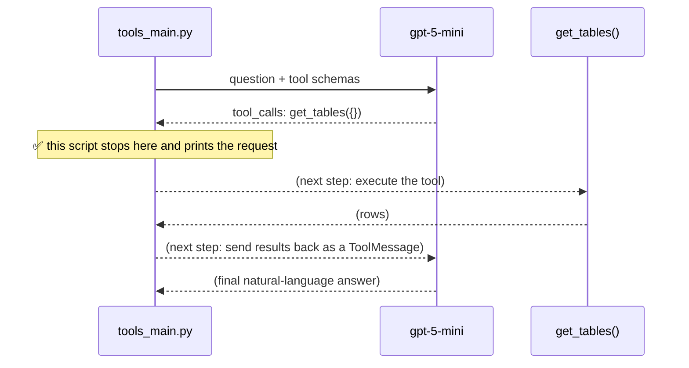
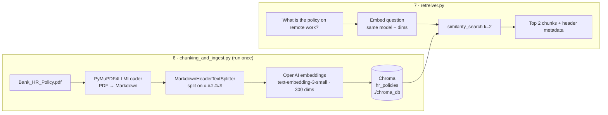

<div align="center">

# 🦜🔗 LangChain Examples

**Small, standalone, runnable examples that teach the core ideas of LangChain, one concept per file.**

Chat models · Prompt chains (LCEL) · Conversation memory · Structured output · Tool calling · RAG with Chroma


</div>

---

## 📚 Contents

1. [What is LangChain?](#-what-is-langchain)
2. [What problem does it solve?](#-what-problem-does-it-solve)
3. [Core building blocks](#-core-building-blocks)
4. [Quick start](#-quick-start)
5. [Configuration](#-configuration)
6. [The examples, concept by concept](#-the-examples-concept-by-concept)
   - [1. Chat models & swapping providers](#1-chat-models--swapping-providers--mainpy)
   - [2. Conversation history (memory)](#2-conversation-history-memory--conversation_historypy)
   - [3. Prompt templates & chains (LCEL)](#3-prompt-templates--chains-lcel--langchain_mainpy)
   - [4. Structured output](#4-structured-output--structured_outputpy)
   - [5. Tools & tool calling](#5-tools--tool-calling--toolspy--tools_mainpy)
   - [6. RAG: ingest a PDF into Chroma](#6-rag-part-1-ingest-a-pdf--chunking_and_ingestpy)
   - [7. RAG: retrieve relevant chunks](#7-rag-part-2-retrieve--retreiverpy)
7. [Repository layout](#-repository-layout)
8. [Known issues](#-known-issues)
9. [Where to go next](#-where-to-go-next)

---

## 🧠 What is LangChain?

**LangChain is an open-source Python (and JavaScript) framework for building applications powered by large language models (LLMs).**

An LLM on its own is a function that takes text in and returns text out. A real application needs much more around it: prompts built from variables, conversation state, answers your code can parse, access to your own documents and databases, and the ability to call functions. LangChain gives you **standard, swappable components** for each of those pieces, plus a simple way to **compose them into pipelines**.



## 🎯 What problem does it solve?

| Without a framework | With LangChain |
| --- | --- |
| Every provider (OpenAI, Google, Hugging Face, …) has its own SDK, message format, and response shape. Switching models means rewriting code. | **One interface** for all chat models: `model.invoke(...)`. Swap providers by changing one line (see `main.py`). |
| Prompts are f-strings scattered around the codebase. | **Prompt templates** with named variables, reusable and testable. |
| You parse free-form model text with regex and hope it's consistent. | **Output parsers** and **structured output** return plain strings or validated Pydantic objects. |
| The model has no memory between calls. | **Message objects** (`SystemMessage`, `HumanMessage`, `AIMessage`) make conversation state explicit. |
| The model can't see your private data. | **Loaders → splitters → embeddings → vector stores → retrievers** form a ready-made RAG pipeline. |
| The model can't take actions. | **Tools** turn Python functions into something a model can ask to call, with an auto-generated schema. |
| Multi-step logic is glue code. | **LCEL** (`prompt \| model \| parser`) composes any of these components into a chain. |

In short, LangChain handles the **plumbing** around the LLM so you can focus on application logic, and keeps you **vendor-neutral**.

## 🧱 Core building blocks

Every example in this repo uses one or more of these:

| Concept | What it is | Where it's used here |
| --- | --- | --- |
| **Chat model** | A wrapper around an LLM provider exposing `.invoke()` | Every script |
| **Messages** | Typed chat turns: system, human, AI | `conversation_history.py` |
| **Prompt template** | Text with `{placeholders}` filled at runtime | `langchain_main.py` |
| **Output parser** | Converts model output into a usable type | `langchain_main.py` |
| **Runnable / LCEL** | The common interface (`invoke`, `batch`, `stream`) that lets components be piped with `\|` | `langchain_main.py` |
| **Structured output** | Forces the model to return data matching a schema | `structured_output.py` |
| **Tool** | A Python function the model can request to call | `tools.py`, `tools_main.py` |
| **Document loader** | Reads a source (PDF, web, …) into `Document` objects | `chunking_and_ingest.py` |
| **Text splitter** | Breaks large documents into retrievable chunks | `chunking_and_ingest.py` |
| **Embeddings** | Turns text into vectors that capture meaning | ingest + retriever |
| **Vector store** | Stores vectors and finds the most similar ones | ingest + retriever (Chroma) |

---

## 🚀 Quick start

```powershell
# 1. Create and activate a virtual environment
py -m venv .venv
.\.venv\Scripts\Activate.ps1

# 2. Install dependencies
py -m pip install -r requirements.txt

# 3. Create .env (see Configuration), then run any example
py main.py
```

<details>
<summary>macOS / Linux equivalent</summary>

```bash
python3 -m venv .venv
source .venv/bin/activate
pip install -r requirements.txt
python main.py
```

> The SQL Server tools use Windows authentication (`Trusted_Connection=yes`), so those examples expect Windows.

</details>

> [!IMPORTANT]
> Run every script **from the repository root** so relative paths like `docs/Bank_HR_Policy.pdf` and `./chroma_db` resolve correctly.

### Prerequisites

| Requirement | Needed for |
| --- | --- |
| Python 3.10+ (the code uses `dict \| None` type syntax) | Everything |
| Packages in [`requirements.txt`](./requirements.txt) | Everything |
| An OpenAI API key | Most examples (chat model + embeddings) |
| SQL Server, **ODBC Driver 18 for SQL Server**, and `pyodbc` | SQL tools only |

---

## 🔐 Configuration

Create a `.env` file in the repository root. Add only the keys for the examples you plan to run.

```dotenv
# Model providers
OPENAI_API_KEY=       # gpt-5-mini chat model + text-embedding-3-small
GOOGLE_API_KEY=       # Gemini alternative in main.py (commented out)
HF_TOKEN=             # Hugging Face Llama 3.3 endpoint in main.py

# Tools
FINNHUB_API_KEY=      # get_stock_price in tools.py

# SQL Server (optional; defaults shown)
SQL_SERVER=localhost\MSSQLSERVER03
SQL_DATABASE=retail
```

> [!WARNING]
> `.env` is already in `.gitignore`. Never commit it, paste it into chats or tickets, or put keys in code. If a key is ever exposed, revoke it and create a new one.

> [!NOTE]
> `meta-llama/Llama-3.3-70B-Instruct` is a gated model. Accept its license on Hugging Face before using your token.

---

## 🧪 The examples, concept by concept

Each file is an independent program; there is no single entry point. They're ordered roughly from simplest to most advanced.

### 1. Chat models & swapping providers · `main.py`

**Concept:** LangChain gives every LLM provider the same interface, so the rest of your code doesn't care which model is behind it.

```python
#model = ChatOpenAI(model="gpt-5-mini")
#model = ChatGoogleGenerativeAI(model="gemini-2.5-flash")

llm = HuggingFaceEndpoint(repo_id="meta-llama/Llama-3.3-70B-Instruct", task="text-generation")
model = ChatHuggingFace(llm=llm)

response = model.invoke("tell me about ai agents in 10 words?")
print(response.content)
```

- `HuggingFaceEndpoint` is a raw text-generation endpoint; `ChatHuggingFace` wraps it so it accepts chat messages like the other providers.
- Uncomment either alternative and **nothing else changes**. That's the provider-abstraction benefit in one file.
- `invoke()` returns an `AIMessage`; the text is in `.content`.

```powershell
py main.py
```

### 2. Conversation history (memory) · `conversation_history.py`

**Concept:** LLMs are stateless. Each call only knows what you send it. "Memory" means **you resend the conversation so far** on every turn.

```python
conversation = [SystemMessage(content="You are a senior data engineer. Answer ... in 3 to 4 sentences.")]

while True:
    query = input("Ask a question: ")
    conversation.append(HumanMessage(content=query))
    response = model.invoke(conversation)          # full history every time
    conversation.append(AIMessage(content=response.content))
```

- **`SystemMessage`** sets the persona and rules; **`HumanMessage`** is the user; **`AIMessage`** is the model's reply.
- Because previous turns are included, follow-ups like *"why?"* or *"give an example of that"* work.
- Trade-off: the list grows every turn, which raises cost and eventually hits the context limit. Real apps trim or summarize older messages.

```powershell
py conversation_history.py   # type 'exit' to quit
```

### 3. Prompt templates & chains (LCEL) · `langchain_main.py`

**Concept:** The **LangChain Expression Language (LCEL)** lets you connect components with the `|` pipe operator. The output of each step becomes the input of the next.

```python
prompt  = PromptTemplate(template="tell me about {topic} in 100 words")
prompt1 = PromptTemplate(template="based on below article, create 5 quiz questions\n\n{article}")
parser  = StrOutputParser()

chain = prompt | model | parser | prompt1 | model | parser
print(chain.invoke({"topic": "ai agents"}))
```



- **`PromptTemplate`** fills `{topic}` at runtime.
- **`StrOutputParser`** turns the model's `AIMessage` into a plain string.
- The first `parser` outputs a string, and `prompt1` has exactly one variable (`{article}`), so LangChain maps that string into it automatically.
- Every piece is a **Runnable**, so the whole chain also supports `.batch()` and `.stream()` for free.

```powershell
py langchain_main.py
```

### 4. Structured output · `structured_output.py`

**Concept:** Instead of parsing free text, define a **Pydantic schema** and have the model return an object that matches it.

```python
class SQLOutput(BaseModel):
    query: str = Field(description="The generated SQL query.")
    explanation: str = Field(description="A brief explanation of the SQL query.")

model_structured = model.with_structured_output(SQLOutput)
response = model_structured.invoke("give me sql to get top 5 products by sales from orders table")

print(response.query)
print(response.explanation)
```

- `with_structured_output()` sends the schema to the provider (using its native structured-output or function-calling feature) and validates the reply.
- You get a typed `SQLOutput` instance with real attributes. No regex, no `json.loads`.
- The `Field(description=...)` text is part of what the model sees, so good descriptions improve results.

```powershell
py structured_output.py
```

### 5. Tools & tool calling · `tools.py` + `tools_main.py`

**Concept:** A **tool** is a Python function the model can *ask* to call. The `@tool` decorator reads the function name, type hints, and docstring to build a schema the model understands.

#### Tools defined in `tools.py`

| Tool | What it does |
| --- | --- |
| `get_engine(server, database)` | (Re)connects to SQL Server via SQLAlchemy + ODBC Driver 18 with Windows auth |
| `get_tables()` | Lists base tables in the `dbo` schema |
| `get_schema(table_name)` | Returns column names and data types for a `dbo` table |
| `validate_select_query(query)` | Confirms a query is a single read-only `SELECT` / `WITH … SELECT` |
| `run_query(query, params)` | Runs a validated read-only query and returns rows as a list of dicts |
| `get_stock_price(ticker)` | Fetches the current price from the Finnhub API |

**Built-in safety guard.** Every SQL tool runs through `_validate_select()`, which rejects:

- empty queries, multiple statements (`;`), and SQL comments (`--`, `/* */`)
- anything not starting with `SELECT` or `WITH`
- write/DDL keywords: `INSERT`, `UPDATE`, `DELETE`, `MERGE`, `DROP`, `ALTER`, `CREATE`, `TRUNCATE`, `EXEC`, `GRANT`, `REVOKE`, `INTO`

Results are returned as plain lists of dicts (not DataFrames) so they serialize cleanly to JSON for the model.

#### Binding tools to a model in `tools_main.py`

```python
my_tools = [get_engine, get_stock_price, get_tables, get_schema]
model_tools = model.bind_tools(my_tools)

result = model_tools.invoke("show me all the tables in the database")
for tool_call in result.tool_calls:
    print(f"Calling tool '{tool_call['name']}' with arguments {tool_call['args']}")
```



> [!NOTE]
> **The model never runs your code.** It only returns a *request* (tool name + arguments). Your program decides whether to execute it. This script shows step 1 only; the dashed steps are what an **agent loop** adds (see [Where to go next](#-where-to-go-next)).

```powershell
py tools_main.py
```

---

### 🔎 Retrieval-Augmented Generation (RAG)

**Why RAG?** An LLM doesn't know your internal documents (here, a bank HR policy). Retraining it is expensive. Instead, **retrieve** the relevant passages at question time and give them to the model as context. Examples 6 and 7 build the retrieval half of that pipeline.



### 6. RAG part 1: ingest a PDF · `chunking_and_ingest.py`

| Step | Component | Why |
| --- | --- | --- |
| **Load** | `PyMuPDF4LLMLoader(..., mode="single")` | Converts the whole PDF into **one Markdown document**, keeping headings as `#`, `##`, `###`. |
| **Split** | `MarkdownHeaderTextSplitter` | Splits at section headings, so each chunk is one coherent policy section. The heading text is stored as metadata (`Header 1/2/3`), so you always know where a chunk came from. |
| **Embed** | `OpenAIEmbeddings("text-embedding-3-small", dimensions=300)` | Turns each chunk into a 300-number vector that captures meaning. Fewer dimensions mean less storage and faster search. |
| **Store** | `Chroma(collection_name="hr_policies", persist_directory="./chroma_db")` | A local vector database saved to disk, so you ingest once and query many times. |

> [!TIP]
> Splitting by **structure** (headings) usually beats splitting by a fixed character count for policy documents, because a chunk never cuts a rule in half. `chunking.py` contains an earlier version of this step for comparison.

```powershell
py chunking_and_ingest.py
```

> [!CAUTION]
> `add_documents()` **appends**. Running ingestion twice stores duplicate chunks. To rebuild cleanly, delete `./chroma_db` first.

### 7. RAG part 2: retrieve · `retreiver.py`

```python
embeddings = OpenAIEmbeddings(model="text-embedding-3-small", dimensions=300)   # must match ingest
vector_store = Chroma(collection_name="hr_policies", embedding_function=embeddings,
                      persist_directory="./chroma_db")

similar_docs = vector_store.similarity_search("What is the policy on remote work?", k=2)
print(similar_docs)
```

- The question is embedded with the **same model and dimensions** used at ingest. Otherwise the vectors aren't comparable.
- `similarity_search(k=2)` returns the two chunks whose vectors are closest in meaning, even if they don't share exact words with the question.
- Each result is a `Document` with `page_content` and the header `metadata` from step 6.

```powershell
py retreiver.py
```

> **This is the "R" in RAG.** To complete it, insert the retrieved chunks into a prompt and ask the chat model to answer from them (see [Where to go next](#-where-to-go-next)).

---

## 🗂️ Repository layout

```text
.
├── main.py                    # 1 · chat models & provider swapping
├── conversation_history.py    # 2 · message history / memory
├── langchain_main.py          # 3 · prompt templates + LCEL chains
├── structured_output.py       # 4 · Pydantic structured output
├── tools.py                   # 5 · SQL Server + Finnhub tools
├── tools_main.py              # 5 · binding tools to a model
├── chunking_and_ingest.py     # 6 · RAG ingest: PDF → chunks → Chroma
├── chunking.py                #     earlier chunking experiment
├── retreiver.py               # 7 · RAG retrieval
├── docs/
│   └── Bank_HR_Policy.pdf     # source document for RAG
├── chroma_db/                 # generated vector store (rebuildable)
├── requirements.txt
├── .env                       # your keys (git-ignored)
└── .gitignore
```

---

## ⚠️ Known issues

- **`.env` values may be ignored by `tools_main.py`.** `tools.py` reads `FINNHUB_API_KEY`, `SQL_SERVER`, and `SQL_DATABASE` at import time, but `tools_main.py` imports `tools` *before* calling `load_dotenv()`.
  **Fix:** move `load_dotenv()` above `from tools import ...`, or call `load_dotenv()` at the top of `tools.py`.
- **`pyodbc` is missing from `requirements.txt`.** The SQL engine uses `mssql+pyodbc`, so add `pyodbc` before running the SQL tools.
- **Re-running ingestion duplicates chunks.** See the caution in example 6.
- **`retreiver.py` is misspelled.** Commands above use the actual filename; consider renaming it to `retriever.py`.

---

## 🧭 Where to go next

| Next step | Builds on | Idea |
| --- | --- | --- |
| **Complete the RAG loop** | 3 + 7 | `vector_store.as_retriever()` → format docs into a prompt → `model` → `StrOutputParser`, all as one LCEL chain. |
| **Add an agent loop** | 5 | Execute each `tool_call`, return the result as a `ToolMessage`, and repeat until the model answers. LangChain's agent helpers and LangGraph handle this loop for you. |
| **Text-to-SQL agent** | 4 + 5 | Combine `get_tables` → `get_schema` → `validate_select_query` → `run_query` so the model can answer data questions end to end. |
| **Stream responses** | 1, 3 | Replace `.invoke()` with `.stream()` to print tokens as they arrive. |
| **Trim long histories** | 2 | Keep the system message plus the last *N* turns to control cost. |

---

## 📝 Notes

- Model and embedding calls require network access and incur provider charges.
- `./chroma_db` is generated data. Delete it and re-run ingestion to rebuild.